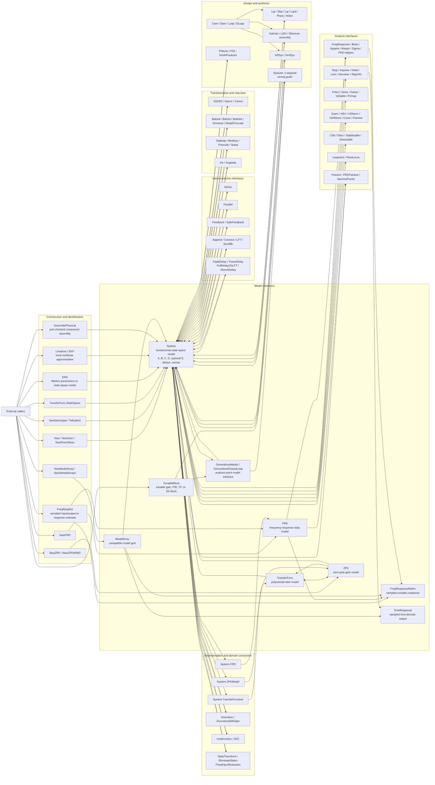

# Controlsys Codebase Interface Diagram

This diagram shows the current module interfaces after the PR149-151 architecture deepening work. It is a codebase-level view, not a complete call graph: the public model interfaces are centered, and the internal seams show where recurring rules are localized.

## Public Interface Map

Rendered SVG: [codebase-public-interface-map.svg](codebase-public-interface-map.svg)

## Internal Seam Map

Rendered SVG: [codebase-internal-seam-map.svg](codebase-internal-seam-map.svg)

```mermaid
classDiagram
    class System {
        +Dims()
        +Validate()
        +Poles()
        +IsStable()
        +IsContinuous()
        +IsDiscrete()
        +Simulate()
        +FreqResponse()
        +TransferFunction()
    }

    class TransferFunc {
        +Dims()
        +Eval()
        +EvalMulti()
        +StateSpace()
        +ZPK()
    }

    class ZPK {
        +Dims()
        +Eval()
        +FreqResponse()
        +TransferFunction()
        +StateSpace()
    }

    class FRD {
        +Dims()
        +NumFrequencies()
        +At()
        +Abs()
        +SelectFrequencies()
        +MapResponse()
        +PeakGain()
        +FreqResponse()
        +Bode()
    }

    class ModelArray {
        +Shape()
        +Model()
        +SelectFlat()
        +FreqResponse()
        +Step()
    }

    class GeneralizedModel {
        +InsertAnalysisPoint()
        +AnalysisPoint()
        +CurrentSystem()
    }

    class GeneralizedClosedLoop {
        +OpenLoop()
        +ClosedLoop()
        +Sensitivity()
        +ComplementarySensitivity()
    }

    class TunableBlock {
        +CurrentSystem()
        +FreeParameters()
        +SampleBlock()
    }

    class descriptorPolicy {
        +validate()
        +poles()
        +requireStandard()
        +requireRiccatiStandard()
    }

    class timeDomain {
        +validateSampleTime()
        +frequencyVariable()
        +ensureCompatible()
    }

    class delayTopology {
        +totalExternal()
        +decomposedExternal()
        +decomposableExternal()
    }

    class delayConversionPolicy {
        +applyDiscreteDelayFields()
        +applyContinuousDelayFields()
        +replaceDiscreteExternal()
        +replaceContinuousExternal()
    }

    class interconnectionTopology {
        +seriesDelayPlan()
        +parallelDelayPlan()
        +seriesRequiresLFT()
        +parallelRequiresLFT()
    }

    class realizationTransformPolicy {
        +requireStandard()
        +requireDelayFree()
        +result()
        +resultWithOriginalFeedthrough()
        +resultWithZeroFeedthrough()
    }

    class stateSpaceUtilitySeam {
        +NewDescriptor()
        +ToExplicit()
        +EliminateStates()
        +FixedInputReduction()
        +AugmentInternalDelayOutputs()
    }

    class frequencyEvaluator {
        +response()
        +eval()
    }

    class timeResponsePlanner {
        +auto()
        +lsim()
    }

    class simulationDispatcher {
        +run()
    }

    class sampledResponseLayout {
        +offset()
        +blockOffset()
    }

    class generalizedPlantPartition {
        +validateControllerChannels()
        +newController()
        +closedLoopPoles()
    }

    class generalizedTuningSeam {
        +analysisPoints()
        +openLoop()
        +closedLoop()
        +tunableController()
    }

    class tuningGoalEvaluator {
        +tracking()
        +maxGain()
        +loopShape()
        +margin()
        +pole()
        +overshoot()
    }

    class passivitySeam {
        +Passive()
        +FRDPassive()
        +SpectralFactor()
    }

    class physicalAssemblySeam {
        +validatePorts()
        +prefixMetadata()
        +appendComponents()
    }

    class modelArraySeam {
        +validateCompatible()
        +flatIndex()
        +freqResponse()
        +step()
    }

    class controllerObserverPolicy {
        +validateNoise()
        +regulator()
        +estimator()
    }

    class matrixEquationProblem {
        +riccatiProblem
        +lyapunovProblem
    }

    System --> descriptorPolicy : descriptor gate
    System --> timeDomain : time-domain rules
    System --> delayTopology : external delay decomposition
    System --> delayConversionPolicy : delay conversion
    System --> interconnectionTopology : interconnection planning
    System --> realizationTransformPolicy : realization assembly
    System --> stateSpaceUtilitySeam : state-space utilities
    System --> frequencyEvaluator : frequency response
    System --> timeResponsePlanner : time response
    System --> simulationDispatcher : sampled simulation
    System --> passivitySeam : passivity and spectral factor
    System --> physicalAssemblySeam : physical component assembly
    System --> ModelArray : compatible model arrays

    TransferFunc --> System : realization
    ZPK --> TransferFunc : rational-channel conversion
    FRD --> sampledResponseLayout : sampled response access
    frequencyEvaluator --> sampledResponseLayout : flat response layout
    ModelArray --> modelArraySeam : array validation and analysis
    GeneralizedModel --> generalizedTuningSeam : analysis-point model wrapper
    GeneralizedClosedLoop --> generalizedTuningSeam : loop extraction
    TunableBlock --> generalizedTuningSeam : sampled controller blocks

    generalizedPlantPartition --> System : H2/Hinf controller synthesis
    generalizedTuningSeam --> tuningGoalEvaluator : fixed-structure tuning
    tuningGoalEvaluator --> System : evaluates closed-loop model
    controllerObserverPolicy --> System : regulator and estimator assembly
    matrixEquationProblem --> controllerObserverPolicy : Riccati and Lyapunov validation
```

## Interface Reading Guide

- `System` is the fundamental representation. Most public workflows either consume it, return it, or convert another model interface into it.
- `TransferFunc`, `ZPK`, `FRD`, `ModelArray`, and generalized/tunable model wrappers are alternate caller-facing interfaces. They preserve input/output names, sample time, and analysis-point metadata where the representation supports them.
- Interconnection routines concentrate compatibility checks, direct feedthrough handling, delay movement, and metadata propagation behind a small caller-facing interface.
- Delay behavior is intentionally split between topology and conversion seams: topology answers what delay structure exists; conversion decides whether it remains explicit, becomes a delay bank, or moves into LFT form.
- Analysis routines share sampled-response layouts so frequency-response data, Bode results, singular-value analysis, and frequency-response estimates use the same output/input/frequency indexing.
- Model-array, physical-assembly, and state-space utility seams make MATLAB-parity workflows available while keeping compatibility checks and metadata rules localized.
- Synthesis routines route generalized-plant, generalized tuning, and controller/observer rules through policy modules before returning controller or closed-loop state-space models.
